# 🎬 Clip Generator

[](https://www.python.org/)
[](https://pytorch.org/)
[](https://github.com/astral-sh/ruff)
[](https://github.com/TomSchimansky/CustomTkinter)

An automated, hardware-accelerated, AI-driven highlight extraction and video clipping workstation for content creators, streamers, and video editors.

**Clip Generator** ingests full-length livestream VODs or local recordings (OBS, gameplay, podcasts), extracts multi-track audio, runs high-speed local GPU transcription with sound dynamics analysis (screaming, combat transients, laughing fits), and prompts modern large language models (Google Gemini, Anthropic Claude, OpenAI, xAI Grok, DeepSeek) to pinpoint the most engaging, hilarious, and viral moments. Extracted clips are rendered with NVENC/CUDA GPU acceleration, vertical 9:16 auto-cropping, VR deshake stabilization, and thumbnail generation.

---

## 🌟 Key Features

### 🎙️ Audio Intelligence & Local Whisper
* **100% Free Local GPU Transcription:** Runs OpenAI's Whisper model directly on your NVIDIA GPU (`cuda` / `fp16`) or CPU fallback. Zero transcription API costs.
* **Deterministic Disk Caching:** Transcriptions are automatically hashed and cached on disk (`%APPDATA%/jBahrsClipGenerator/transcripts/`). Re-analyzing or re-cutting a video with different prompts takes seconds without re-transcribing.
* **Local-Baseline Loudness:** Every transcript line gets `[LOUDNESS: X%]` measured against the *surrounding* background level (rolling ±30 s median), not the global maximum, so one huge scream no longer flattens the rest of the stream.
* **Laughter / Scream Detection (no extra dependencies):** A numpy-only detector reads the raw waveform and inserts standalone `[LAUGHTER 80%]`, `[SCREAM 90%]` and `[LOUD 60%]` lines into the transcript. Laughter is found by sustained, regular 3-8 Hz amplitude pulsing that is louder than the baseline; screams by short bursts far above the baseline with a high spectral centroid. These are heuristics, not a trained classifier - the LLM treats them as hints and weighs them against the text.
* **Combat & Transient Action Detection:** Sharp percussive transients (gunshots, explosions, hits) are tagged `[ACTION: COMBAT]`.
* **Word-Level Timestamps:** Whisper runs with `word_timestamps`, which is what makes precise clip boundaries possible.
* **Multi-Track OBS Downmixing:** Automatically inspects multi-track containers via `ffprobe` and downmixes all channels (Mic, Discord, Game) via FFmpeg `amix` to ensure no speech is lost.

### 🧠 Multi-Provider LLM Highlight Detection
* **Two-Pass Windowed Analysis:** The transcript is cut into overlapping 12-minute windows (60 s overlap). Each window is analysed separately, so long streams are no longer squeezed into one request where the model loses the middle. Candidates from all windows are de-duplicated and then re-scored in one short second request, putting scores from different windows on a common scale. Short videos still go out in a single request.
* **Predictable Clip Count:** The LLM only *nominates* candidates (score 5-10). The number of exported clips is controlled in code by **Target clips per hour** (Settings, default 12, `0` = no limit) and a minimum score (`min_clip_score`, default 6): the best non-overlapping candidates win. A 1.5-hour VOD yields *up to* about 18 clips (fewer only if there are not enough good candidates) instead of whatever the model felt like.
* **Boundary Refinement in Code:** Clip start/end are snapped to phrase boundaries (word level inside long segments), guarantee setup before and reaction after the model-reported `peak_time`, let a laugh play out, and and keep neighbouring clips from overlapping (the exporter adds its own pre/post-roll), so clips stop starting or ending mid-sentence.
* **Universal Model Support:** Native, direct API clients with automatic fallback:
  * **Google Gemini:** `gemini-3.5-flash`, `gemini-3.1-pro`, `gemini-2.5-flash`, `gemini-2.5-pro` (large context).
  * **Anthropic Claude:** `claude-sonnet-5`, `claude-opus-5`, `claude-haiku-4-5`.
  * **OpenAI:** `gpt-5.5`, `gpt-5.4`, `gpt-4o`, `gpt-4o-mini`.
  * **xAI:** `grok-4.3`, `grok-4.6`, `grok-4-1-fast-*`.
  * **DeepSeek & OpenRouter:** `deepseek-v4-flash`, `deepseek-v4-pro`, or any custom OpenAI-compatible endpoint.
* **Dynamic Model Discovery:** Automatically queries provider endpoints in the background to keep the model picker updated with the latest available releases.
* **Configurable Prompt Profiles:** The built-in Default prompt documents the audio tags, has an explicit boundary-cutting section and a worked example, an absolute 1-10 rubric, and `"clip it"` voice-command recognition. The protected Default profile is re-synced from the codebase on every launch; custom profiles are left untouched.

### ⚡ GPU-Accelerated Video Pipeline
* **Hardware Encoding (NVENC / AMF / CUDA):** Renders output MP4 clips using dedicated hardware encoders (`h264_nvenc`) for blazing-fast export speeds.
* **Vertical 9:16 Auto-Cropping:** Ready-to-publish exports for TikTok, YouTube Shorts, and Instagram Reels:
  * *Standard Center Crop*
  * *Left-Third (Facecam)*
  * *Right-Third*
  * *Blurred Background (Portrait)*
  * *Custom Coordinate Crop*
* **VR Deshake Filter:** Optional post-processing filter to stabilize jittery head-tracking motion in VR gameplay recordings.
* **Thumbnail & Metadata Generation:** Automatically produces `.jpg` poster frames and `.json` sidecars containing timestamps, duration, virality score, and AI justification for each clip.

### 🖥️ Desktop Workstation
* **Modern Dark UI:** Built with CustomTkinter for a sleek, responsive interface.
* **Batch Video Clipper:** Select and process local video files or recordings in an efficient queue.
* **Built-in Clip Gallery:** Review clips directly in the application, sort by Date or Virality Score, view AI reasoning notes, play video highlights, and batch delete unwanted cuts.
* **Discord Webhook Alerts:** Sends rich notifications to your Discord channels when clipping jobs complete.

---

## 🏗️ Architecture & Pipeline

```mermaid
flowchart LR
    A[Raw Local Video / Recording] --> B[FFmpeg Audio Ingestion]
    B -->|amix Multi-Track| C[16kHz PCM Buffer]
    C --> D[Local GPU Whisper + word timestamps]
    C --> E[Local-baseline loudness, combat, laughter & scream events]
    D & E --> F[Annotated Transcript]
    F --> G1[LLM: candidates per 12-min window]
    G1 --> G2[Dedupe + global re-score]
    G2 --> G3[Density selection + boundary refinement]
    G3 -->|Timestamps & Virality Scores| H[GPU FFmpeg Video Engine]
    H -->|NVENC + 9:16 Crop + VR Deshake| I[Rendered MP4 Clips]
    H --> J[Thumbnails & JSON Metadata]
    I & J --> K[Clip Gallery / Discord Webhook]
```



---

## 📋 System Requirements & Prerequisites

### Minimum Requirements
* **Operating System:** Windows 10/11 (64-bit)
* **Python:** 3.10, 3.11, 3.12, or 3.13
* **Package Manager:** [`uv`](https://github.com/astral-sh/uv) (strongly recommended) and `make`

### Hardware Recommendations
* **GPU:** NVIDIA GeForce RTX / GTX series (with CUDA 12.x support) for local Whisper acceleration (`fp16`) and NVENC video exports.
* **RAM:** 16 GB+
* **Disk Space:** High-speed SSD storage for video scratch buffers and caches.

### Required External Binaries
The application expects the following helper executables inside the `bin/` folder (or available in your system `PATH`):

| Binary | Purpose | Download Source |
| :--- | :--- | :--- |
| `ffmpeg.exe` | Video cutting, encoding, audio filters | [gyan.dev FFmpeg Builds](https://www.gyan.dev/ffmpeg/builds/) |
| `ffprobe.exe` | Audio/video stream inspection | Included with FFmpeg |

---

## 🚀 Installation & Quick Start

### 1. Clone the Repository
```bash
git clone https://github.com/jBahrVR/jBahrs-Clip-Generator.git
cd jBahrs-Clip-Generator
```

### 2. Place External Binaries
Ensure `ffmpeg.exe` and `ffprobe.exe` are located in the `bin/` directory:
```
jBahrs-Clip-Generator/
├── bin/
│   ├── ffmpeg.exe
│   └── ffprobe.exe
```

### 3. Setup with `make` (Recommended)

This project uses `make` and `uv` for virtual environment management, PyTorch CUDA wheel resolution, and dependency isolation.

```powershell
# Create virtual environment and install all runtime + dev dependencies:
make install

# Launch the application:
make run
```

---

### 🛠️ Alternative: Manual Setup (without `make`)

If `make` is not installed on your system, you can use `uv` directly:

```powershell
# 1. Create a virtual environment
uv venv .venv

# 2. Activate virtual environment
.venv\Scripts\activate

# 3. Install dependencies with PyTorch CUDA 12.6 support
#    (unsafe-best-match lets uv take numpy & co. from PyPI while torch comes from the CUDA index)
uv pip install --index-strategy unsafe-best-match --extra-index-url https://download.pytorch.org/whl/cu126 -r requirements.txt -r requirements-dev.txt

# 4. Launch the application
python main.py
```

---

## 🧪 Development, Code Quality & Tests

Run the complete test suite, coverage reporting, linter, and dead-code analysis with a single command:

```powershell
make test
```

This target executes:
1. **Pytest Test Suite with Coverage:** `python -m pytest -v --cov=src --cov=main --cov-report=term-missing tests/`
2. **Ruff Linter & Formatter Check:** `python -m ruff check main.py src tests`
3. **Dead Code Analysis:** `python -m vulture main.py src tests --min-confidence 80 --ignore-names event,icon,cls`

---

## 📖 Usage Guide

### 1. Initial Configuration
1. Launch the application (`make run`).
2. Navigate to the **⚙️ Settings** tab.
3. Configure your paths:
   * **Generated Clips Directory:** Destination folder for exported highlight clips.
4. Add your API Key(s) under the **AI Providers** section:
   * **Google AI Studio (Gemini):** *Recommended* for multi-hour recordings due to the massive context window (2M tokens).
   * **Anthropic / OpenAI / xAI / DeepSeek:** Supported out-of-the-box.
5. Click **"Save Settings"** to persist changes.

### 2. Video Highlight Extraction
1. Go to the **🎬 Clip Extractor** tab.
2. Select local video file(s) (`.mp4`, `.mkv`, `.avi`, `.mov`, `.flv`) using the **Browse Files** button or enter file paths.
3. Choose the active **Prompt Profile** in Prompt Manager and **Whisper Model** (`tiny`, `base`, `small`, `medium`, `large`). In Settings, tune **Target clips per hour** to control how many clips you get (more clips = lower score bar; `0` disables the limit).
4. Click **"Process Files"** to begin analysis and export.

### 3. Clip Gallery
1. Go to the **🖼️ Clip Gallery** tab.
2. Sort extracted clips by **Date** or **Virality Score**.
3. Select any item to view generated thumbnails, audio duration, and the AI's written justification.
4. Click **▶️ Play Clip** to preview the cut in your default media player.

---

## ⚙️ Configuration Reference

Application settings and cached data are stored in `%APPDATA%/jBahrsClipGenerator/`:
* `config.json` — Active provider, model preferences, crop dimensions, and storage paths.
* `transcripts/` — Cached Whisper JSON transcripts (segments, word timestamps, audio events) indexed by video metadata hashes. The cache is versioned: after an upgrade that changes the layout, videos are transcribed once more automatically.
* `settings.clips_per_hour` (default `12`, `0` = unlimited) and `settings.min_clip_score` (default `6`) in `config.json` control how many clips are exported.
* `logs/` — Timestamped execution and error logs.

---

## 💡 Model Recommendations

| Provider | Model | Best For | Notes |
| :--- | :--- | :--- | :--- |
| **Google** | `gemini-3.5-flash` | **All-round Best** | Large context and fast; windowed analysis keeps quality high on 4+ hour VODs. |
| **Anthropic** | `claude-sonnet-5` | **High Precision** | Exceptional nuanced comedy and banter comprehension. |
| **DeepSeek** | `deepseek-v4-flash` | **Budget / Value** | Cost-effective extraction via official API or OpenRouter. |
| **OpenAI** | `gpt-5.5` | **General Gaming** | Ensure your account tier supports large token requests. |
| **xAI** | `grok-4.3` | **Edgy / Fast Comedy** | Strong grasp of chaotic banter and sarcasm. |

---

## 🤝 Origin & Credits

This project originated from the prototype concept created by [jBahrVR](https://github.com/jBahrVR/jBahrs-Clip-Generator/). 

The current codebase has been entirely re-engineered from the ground up into a production-grade desktop application featuring modular architecture, multi-provider API integrations, native CUDA hardware acceleration, dynamic model discovery, multi-track audio downmixing, comprehensive unit testing, and automated system tray workflows.